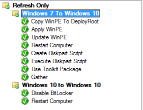

SCCM Packages
===================
The solution requires the following SCCM packages be created

| Package Name | Contents | Source |
|:---|:---|:---|
| WinPE Refresh | LitTouchPE_x64.wim | Output of Create-RefreshMultiToolBootWIM.ps1 |
| Deployment Toolkit | RMTRefreshPC.wsf | TaskSequence\DeploymentToolkit Folder |
| Prepare Disk | PrepareDisk.ps1, Logging.psm1 | TaskSequence\PrepareDisk Folder | 

Task Sequence Step Detail
====================

The screenshot below is a snippit of our Windows 10 Task Sequence. The **Refresh Only** section is separated into two sections, because our Windows 10-to-Windows 10 refresh requires no extra customizations.

###Copy WinPE to Deployroot
Refresh Multi-Tool is designed to be used with an MDT integrated OSD Task Sequence; however, instead of including the LitetouchPE_x64.wim inside the Deployment Toolkit package and downloading it unnecessarily when it's not needed, we chose to deliver it just in time by copying it from the package to the %deployroot%\boot folder during execution. The wim is almost 1GB in size so this approach will result in some measurable time savings.  

| Setting | Value|
|:---|:---|
| Type | Run Command Line|
| Name | Copy WinPE To DeployRoot | 
| Command Line | cmd.exe /c xcopy *.* %DeployRoot%\Boot /h/k/i/s/e/r/y|
| Package | WinPE Refresh |

###Apply WinPE
Now that we have WinPE in %DeployRoot%\Boot, the next step is to use an updated version of LTIApply.wsf to configure the device to boot into WinPE at the next reboot.

>The built-in *Restart Computer* task sequence step should **not** be used. It does something similar to the RMT_LTIApply.wsf script  when you choose the *The boot image assigned to this task sequence* option; however, executing this step where the hard disk encypted with a non-BitLocker solution will render it unbootable. This is because the built-in step runs *bootsect.exe /nt60 c: /mbr* which wipes out the MBR and results in an unbootable encrypted disk.

RMT_LTIApply.wsf is based on LTIApply.wsf which is included with the MDT Deployment Toolkit. The only modification to the file is the removal of the **/mbr** parameter on the bootsect.exe command. **You are responsible for making this update in your Deployment Toolkit package.**

| Setting | Value|
|:---|:---|
| Type | Run Command Line|
| Name | Apply WinPE | 
| Command Line | cscript %DeployRoot%\Scripts\RMT_LTIApply.wsf /pe|

### Update WinPE
In this step the wim that is located in C:\sources\boot.wim is mounted so that it can be further customized. The only runtime customization is copying the C:\\_SMSTaskSequence\\TSEnv.dat to the mounted boot wim.

>The TSEnv.dat file maintains the Task Sequence policy and the progress of the Task Sequence. Since the local disk is encrypted and unreadable from within WinPE, the TSEnv.dat file must be copied into WinPE so it's available later. 

Note: Additional files that need to be persisted can be copied in, if needed, at this time.

| Setting | Value|
|:---|:---|
| Type | Run Command Line|
| Name | Update WinPE | 
| Command Line | cscript %DeployRoot%\Scripts\RMT_RefreshPC.wsf|
| Condition | Task Sequence Variable: _SMSTSInWinPE equals "False"|

It's important that you add a condition to this step **_SMSTSInWinPE = False** so that the step doesn't try to execute again once the Task Sequence is resumed. This is because the TSEnv.dat was previously copied into the boot wim so it won't know that this step has already been executed.  

### Restart Computer
Next the computer needs to be restarted so that it can boot into WinPE and start the conversion process. Since WinPE has already been staged, and the boot loader is configured to boot into WinPE, select **The currently installed default operating system**.

| Setting | Value|
|:---|:---|
| Type | Restart Computer|
| Specify What To Run AFter Restart | The currently installed default operating system | 
| Notify the user before restarting | Checked |
| Condition | Task Sequence Variable: _SMSTSInWinPE equals "False"|

It's important that you add a condition to this step **_SMSTSInWinPE = False** so that the step doesn't try to execute again once the Task Sequence is resumed later.

### WinPE Actions
The rest of the Refresh MultiTool process occurs outside of the Task Sequence while still in WinPE. The readme.md file in the WinPE folder provides more details.

### Format EFI Partition
The build has now entered Phase 3 of the process, and the Task Sequence has been resumed, now that the system has booted using UEFI and a GPT disk.
> During development of this solution we identified that BCD file in the EFI partition was not updated correctly so the build failed during OOBE. Instead of just deleting the BCD file, the entire EFI partition is formatted so that it's clean of artifacts and OSD can update it natively.

| Setting | Value|
|:---|:---|
| Type | Run Command Line|
| Name | Format EFI Partition | 
| Command Line | powershell.exe -ExecutionPolicy ByPass -file .\PrepareDisk.ps1 -BootDisk GPT -Action FormatEfiPartitionOnly |
| Package | Prepare Disk|

### Use Toolkit Package
Stage the Deployment Toolkit package.
| Setting | Value|
|:---|:---|
| Type | Use Microsoft Deployment Toolkit Package|
| Name | Use Toolkit Package | 
| Toolkit Package | Microsoft Deployment Toolkit Files |

### Gather
Execute Gather to acknowledge the updates made to the system. 

| Setting | Value|
|:---|:---|
| Type | Gather |
| Name | Gather | 
| Gather only local data (do not process rules) | Selected |